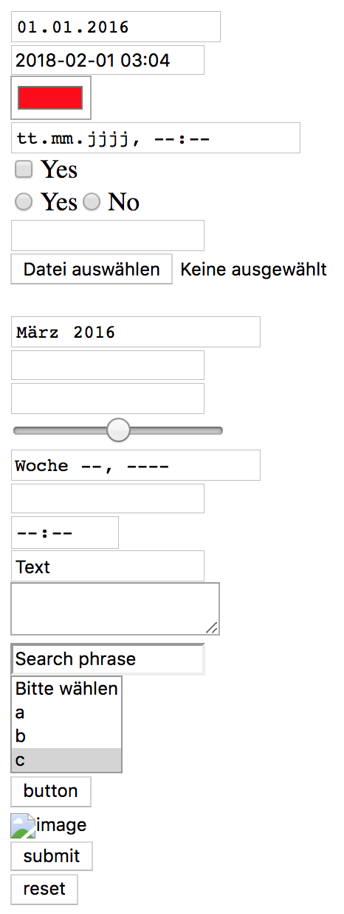

# HTML

HTML is a Packaged that is designed to simplify building of HTML fragments. It is especially useful to build HTML forms.

The class provides a set of helpers to generate HTML in a dynamic way. It's an abstract class that you can extend to add more helpers.

## Installation

Composer is your friend.

~~~
$ composer require tebe/html
~~~

## Usage

### Build a simple form

This is an example to show how to build a simple HTML form.

~~~php
use Tebe\HTML;

echo HTML::getDocType();
echo HTML::tag("html");
echo HTML::tag("body");

if (!empty($_POST)) {
    echo HTML::tag("pre");
    print_r($_POST);
    echo HTML::endTag("pre");
}

HTML::setDefaults([
    "date" => "2016-01-01",
    "dateTime" => "2018-02-01 03:04",
    "dateTimeLocalField" => "2018-02-01T03:04",
    "color" => "#ff0000",
    "text" => "Text",
    "month" => "2016-03",
    "select" => [2, 4],
    "search" => "Search phrase"
]);

echo HTML::form(["index.php", "method" => "post"]);

echo HTML::dateField(["date"]) . HTML::tag("br");
echo HTML::dateTimeField(["dateTime"]) . HTML::tag("br");
echo HTML::colorField(["color"]) . HTML::tag("br");
echo HTML::dateTimeLocalField(["dateTimeLocal"]) . HTML::tag("br");
echo HTML::checkField(["check", "value" => "yes"]) . "Yes" . HTML::tag("br");
echo HTML::radioField(["radio", "value" => "yes"]) . "Yes";
echo HTML::radioField(["radio", "value" => "no"]) . "No" . HTML::tag("br");
echo HTML::emailField(["email"]) . HTML::tag("br");
echo HTML::fileField(["file"]) . HTML::tag("br");
echo HTML::hiddenField(["hidden"]) . HTML::tag("br");
echo HTML::monthField(["month"]) . HTML::tag("br");
echo HTML::passwordField(["password"]) . HTML::tag("br");
echo HTML::numberField(["number"]) . HTML::tag("br");
echo HTML::rangeField(["range"]) . HTML::tag("br");
echo HTML::weekField(["week"]) . HTML::tag("br");
echo HTML::urlField(["url"]) . HTML::tag("br");
echo HTML::timeField(["time"]) . HTML::tag("br");
echo HTML::textField(["text", "autofocus"]) . HTML::tag("br");
echo HTML::textArea(["textArea", "disabled"]) . HTML::tag("br");
echo HTML::searchField(["search", "readonly"]) . HTML::tag("br");
echo HTML::select(["select[]", "multiple" => "1", "useEmpty" => true, "emptyValue" => -1, "emptyText" => "Bitte wählen"], ["a", "b", "c", "d", "e", "f", "g"]) . HTML::tag("br");

echo HTML::pushButton(["button"]) . HTML::tag("br");
echo HTML::imageButton(["image"]) . HTML::tag("br");
echo HTML::submitButton(["submit"]) . HTML::tag("br");
echo HTML::resetButton(["reset"]) . HTML::tag("br");

echo HTML::endForm();

echo HTML::endTag("body");
echo HTML::endTag("html");
~~~

The generated raw form (without any styles) will look like:

### Build a form using arrays

HTML offers array notation to build more complex forms.

~~~php
use Tebe\HTML;

echo HTML::getDocType();
echo HTML::tag("html");
echo HTML::tag("body");

$defaults = [
    "text" => [
        "test" => [
            "a" => "Test A",
            "b" => "Test B"
        ]
    ],
    "select" => [2, 4]
];
HTML::setDefaults($defaults);

echo HTML::tag("pre");
print_r($defaults);
echo HTML::endTag("pre");

if (!empty($_POST)) {
    echo HTML::tag("pre");
    print_r($_POST);
    echo HTML::endTag("pre");
}

echo HTML::form([$_SERVER["PHP_SELF"], "method" => "post"]);

echo HTML::textField(["text[test][a]"]) . HTML::tag("br");
echo HTML::textField(["text[test][b]"]) . HTML::tag("br");
echo HTML::select(["select[]", "multiple" => "1", "useEmpty" => true, "emptyValue" => -1, "emptyText" => "Bitte wählen"], ["a", "b", "c", "d", "e", "f", "g"]) . HTML::tag("br");

echo HTML::submitButton(["submit"]) . HTML::tag("br");
echo HTML::endForm();

echo HTML::endTag("body");
echo HTML::endTag("html");
~~~

## Examples

To run the examples start PHPs built-in webserver:

~~~
$ cd examples
$ php -S localhost:9999
~~~

And then open a web browser:

- Simple form <http://localhost:9999/simple.php>
- Form using arrray notation <http://localhost:9999/array.php>
